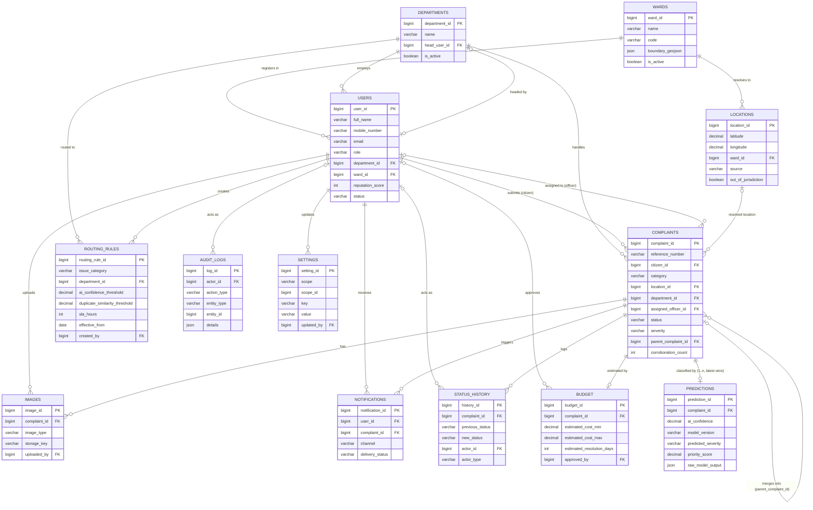

# JANNet AI — Entity Relationship Diagram (Phase 2)

Source of truth: `database/migrations/V1`–`V15`. Regenerate this diagram
whenever a migration changes the schema shape.

## Notes on cardinality deviations from the SRS's own ER summary (19.12)

- **Complaints -> Predictions**: SRS describes this as 1:1. This schema
  allows 1:many to accommodate the AI Analysis Module's documented retry
  behavior (SRS 15.3). See `V8__create_predictions.sql` for the full
  rationale.
- **Departments -> jurisdiction**: SRS's Departments table references a
  `jurisdiction_id -> Locations.ward_id` column that this schema omits
  (single-jurisdiction pilot assumption). See `V2__create_departments.sql`.
- **Users.ward_id target**: corrected from the SRS's stated
  `Locations.ward_id` (which doesn't exist — Locations' PK is
  `location_id`) to `Wards.ward_id`. See `V3__create_users.sql`.
